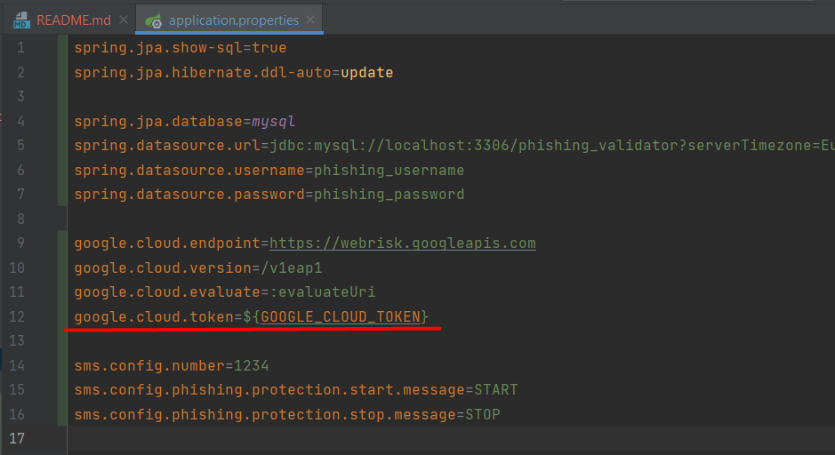
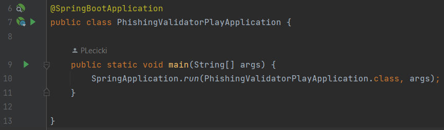
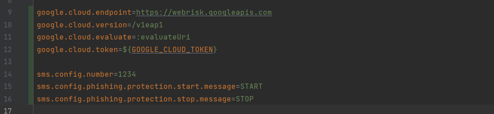
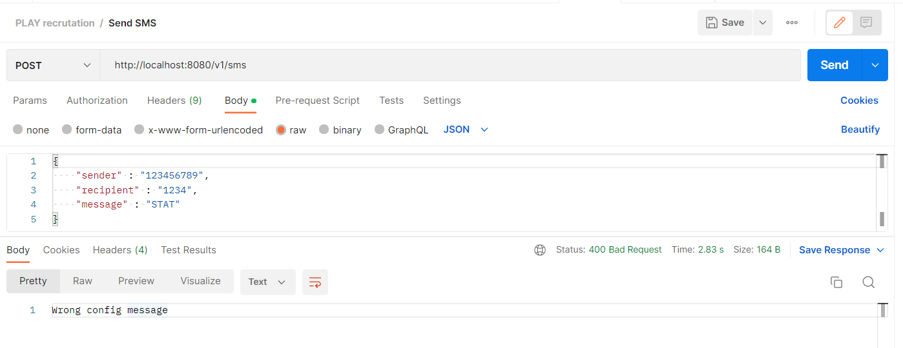
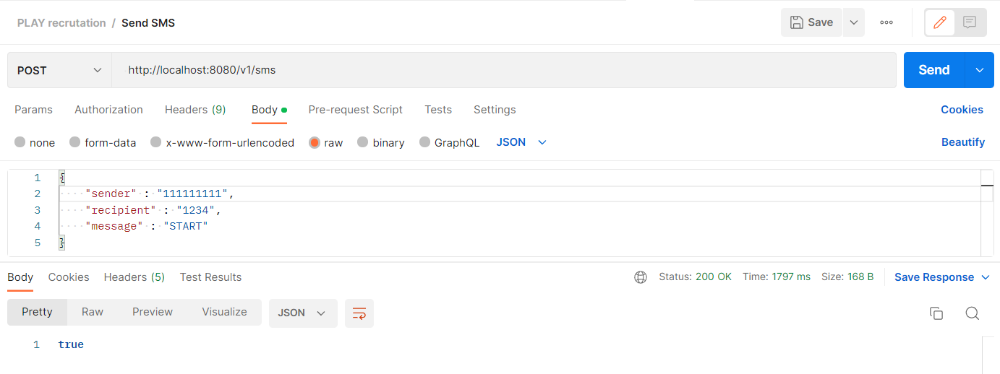
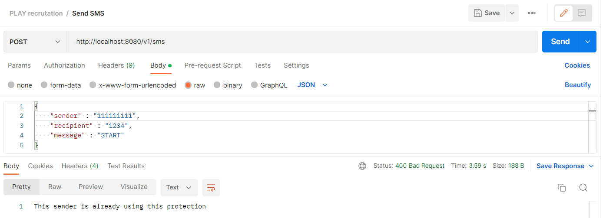
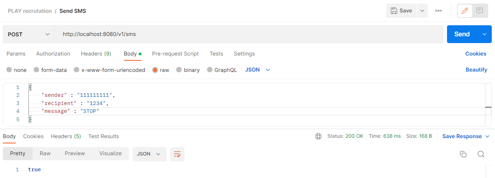
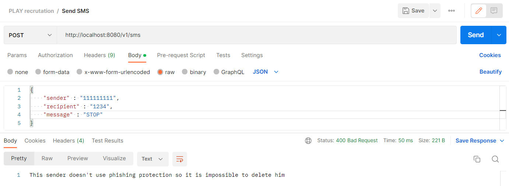

# Rekrutacja Play - Java/Scala Developer - Zadanie_Piotr Łęcicki
### Ze względu, że język oferty oraz treść zadania to polski, to też to README napisałem po polsku. Jeśli jest potrzebne README po angielsku, bardzo proszę o informację, wtedy je dopiszę.
### Niestety realizowałem zadanie bez posiadania tokenu do Google Cloud, stąd część odpowiedzialna za wywoływanie zewnętrznego API nie została przetestowana manualnie, ale przeglądałem kod i jest duża szansa, że po wprowadzeniu tokenu będzie działało wszystko prawidłowo.
### Projekt posiada testy jednostkowe, gdzie potencjalne odpowiedzi z zewnętrznego API zostały zMockowane, dzięki czemu serwis odpowiedzialny za obsługę ochrony antyphishingowej jest pokryty testami jednostkowymi, które sprawdzają jego poprawność przy różnych scenariuszach.
## Instrukcja uruchomienia
### Dodanie zmiennej środowiskowej lub edycja pola w pliku application.properties
#### Dodanie zmiennej środowiskowej
W projekcie została zastosowana dobra praktyka unikania trzymania
danych wrażliwych takich jak token w pliku application.properties. 
 
Stąd przed uruchomieniem wymagane jest stworzenie zmiennej środowiskowej 
o nazwie "GOOGLE_CLOUD_TOKEN" przypisując jej dowolną wartość, żeby 
program się w ogóle uruchomił (Środowisko może wymagać restartu,
żeby załadować zmienne środowiskowe systemu).
#### Edycja pola w pliku application.properties
Drugim sposobem jest przypisanie bezpośrednio wartości do
zmiennej "google.cloud.token" w pliku application.properties np.
"google.cloud.token=AAAA".
#### Stworzenie bazy danych i użytkownika MySQL
W pliku application.properties widnieją dane użytej bazy danych. Program potrzebuje jej do działania
i przed uruchomieniem należy ją przyłączyć, lub zmienić w application.properties
dane na swoją bazę. Proszę również zwrócić uwagę na dane logowania
użytkownika bazy i prosze stworzyć takiego i nadać mu uprawnienia lub
zmienić te dane w pliku na swojego innego użytkownika.
#### Uruchomienie metody main
Kolejnym krokiem jest uruchomienie tego programu, który jest zbudowany
za pomocą frameworka "Spring Boot" uruchamiając metodę main w klasie
"src/main/java/pl/piotr/lecicki/phishingvalidatorplay/PhishingValidatorPlayApplication.java" 

## Opis projektu
### Plik application.properties
W tym pliku zawarte są dane, które w przyszłości mogą wymagać szybkiej zmiany jeśli wymagania biznesowe się zmienią.

Np. Jeśli zostanie zarządana zmiana treści wiadomości włączającej usługę ze "START" na coś innego
wtedy będzie to bardzo łatwo znaleźć i zmienić.
### Klient Google Cloud
Został zaimplementowany klient który za pomocą protokołu HTTP
komunikuje się z zawartym w poleceniu zadania zewnętrznym API.
Niestety nie gwarantuję poprawności działania klienta, ponieważ nie mam tokenu i go nie przetestowałem
### Klasy konfiguracyjne
One pobierają wartości z application.properties i można je wyciągnąć za pomocą getterów.
### Kontroler
Kontroler HTTP udostępnia endpoint, który przyjmuje żądania imitujące SMSy.
### Pakiet "domain"
Tutaj znajdują się klasy encje, enumy pokrywające się z tymi z dokumentacji zewnętrznego API Google Cloud oraz klasy do przesyłania danych tzw DTO - Data Transfer Object.
### Wyjątki - Exceptions
Program posiada handler dzięki któremu, gdy po wysłaniu żądania rzucony jest wyjątek, wtedy osoba wysyłająca żądanie widzi ustawioną wiadomość np.

Zamiast standartowego statusu 400.  
Dodatkowo zostały zaimplementowane wyjątki docelowo pod ten projekt
jak np. PhishingProtectionIsAlreadyWorking który jest wyrzucany przy próbie
wystartowania usługi SMSem o treści "START" numerowi, który już ma ją włączoną
### Mapper
Pełni funkcję zamiany obiektu do transferu danych DTO na obiekt encji, który może być zapisany w bazie danych.
### Repozytoria
Są to interfejsy dziedziczące z RestRepository, których metody wykonują operacje w bazie danych.
### Serwis
Tutaj zawarta jest główna logika działania projektu.
## Dodatkowo zrobione
Projekt zawiera dodatkowo zrobione testy jednostkowe w katalogu "src/test/java/pl/piotr/lecicki/phishingvalidatorplay"
Umożliwiają one automatyczne sprawdzenie, czy program prawidłowo działa pomimo braku tokunu Google Cloud, ponieważ użyłem Mockito jako zaślepki.
W testach są zawarte niestandardowe scenariusze jak np. próba dodania do chronionych użytkownika,
który już jest dodany albo przesłanie błędnej treści na numer konfiguracyjny (np. zamiast "STOP" to "STAP").
## Przykłady działania
### Włączenie usługi

### Włączenie usługi - usługa była już włączona wcześniej

### Wyłączenie usługi

### Wyłączenie usługi - usługa była wyłączona wcześniej

### Wysłanie błędnej treści na numer konfiguracyjny

### Pozostałych żądań poza numer konfiguracyjny nie byłem w stanie sprawdzić, ponieważ nie mam tokenu Google Cloud, ale testy jednostkowe testują SMSService, co w jakimś stopniu potwierdza poprawność działania pomimo braku manualnego przetestowania.
### W razie pytań zachęcam do kontaktu za pomocą komentarzy w tym Pull Request'cie lub dzwoniąc na numer, który jest w CV.